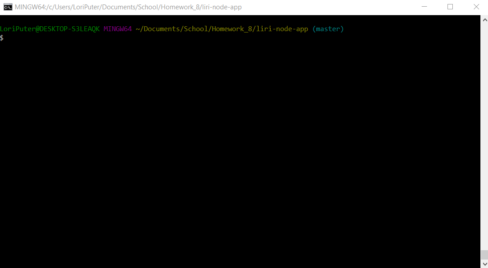

# LIRI Bot

## What the project does
LIRI is a Language Interpretation and Recognition Interface. It is a command line node app that takes in parameters and returns data.

## How to get started with LIRI
To use LIRI Bot, enter one of the commands below with a search keyword.

### Concert Information
To get concert information, such as the Venue, Location and Date of Event, enter this command for any artist or band you wish to search.

_node liri.js concert-this 'artist/band name here'_

### Song Information
To get information on a song, enter this command to get the Artist's Name, Album name and a preview link of the song from Spotify.

_node liri.js spotify-this-song 'song name here'_

### Movie Information
To get movie information, enter this command and get the Year the movie was released, the IMDB and Rotten Tomatoes ratings, as well as the Actors, Plot, Language and Country.

_node liri.js movie-this 'movie name here'_

### Read from File
Don't want to type in single commands? Add a list of commands in the random.txt file and execute this command below to run the entire file.

node liri.js do-what-it-says

### Where to get help
The GIF below will show you how to execute the commands and the results that will be returned.

